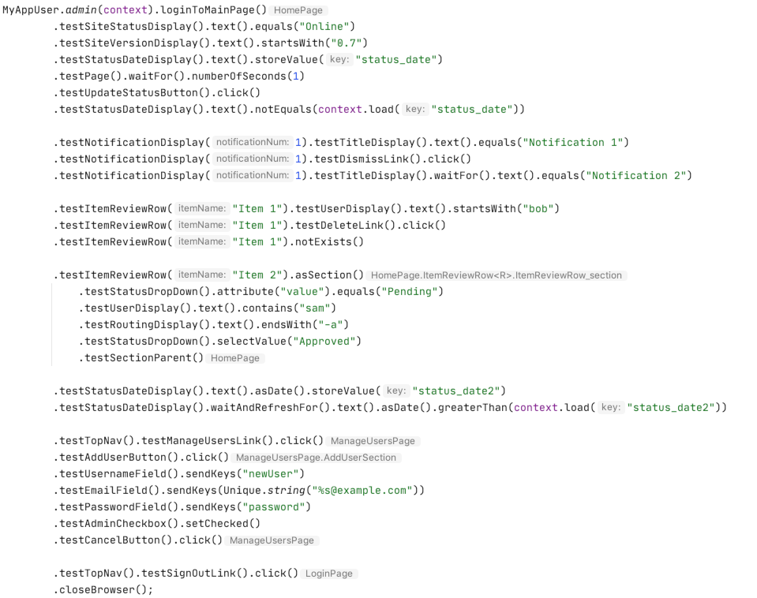
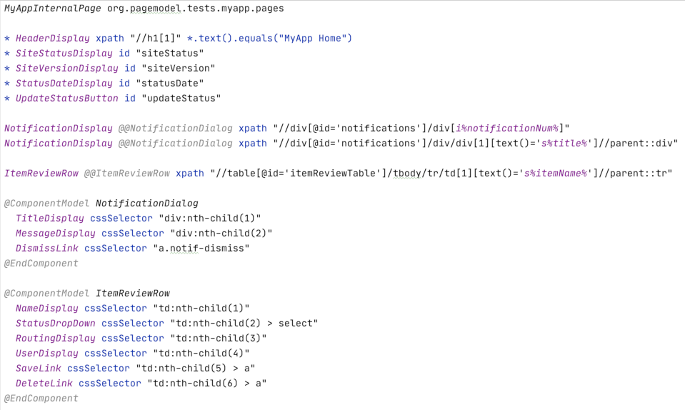

# Page Model Tools
Page Model Tools 0.8.5 has been released to maven central under group id: org.pagemodel.

## What is Page Model Tools?

#### Page Model language for .pagemodel files:
Quickly build maintainable and reusable Page Object Models to describe your web application.
* Pagemodel language to easily define the pages of your website.
* Pagemodel generator to generate page object model java classes from your pagemodel files.

[.pagemodel examples](docs/page-model-example.md)  | [.pagemodel syntax](docs/page-model-gen-readme.md)

#### Page Model intuitive testing api:
Writing tests is easy and easy to learn. Page models provide a complete chaining API. Testing tools and methods are easy to discover as auto-complete guides you through writing tests.

* Consistent testing api across all elements of all pages of all applications.
* Fluent api for your website uses auto-complete to guide you through testing.

[Page and Element test methods](docs/test-methods.md)

#### Project generator:
Use the project generator to create a Java Gradle project for testing your application.  Create a project and get started right away.  Your project will be setup following best practices for configuring testing environments, loading test values during test setup, managing browsers to support parallel testing.
* Create a new testing project with a single command.
* Creates a consistent testing project structure across different applications.
* Publish page models to maven and re-use in other testing projects.

[Getting started](#getting-started)

#### Test organization:
Test against any local or remote browsers.  Easy to configure different browser environments with no hassle.  Run tests using a headless browser in docker for easy pipeline integration.
* Target different test data sets and test environments.
* Target different local or remote browsers with specific capabilities.
* Web drivers are managed to support running tests in parallel.
* Docker images to easily run tests in a build pipeline.

#### Stable testing for your project:
Development of the Page Model Tools project happens across the pagemodel testing engine and the pagemodel java generator leaving the pagemodel language and testing api stable.
Updating to newer versions of Page Model Tools do not require changes to your pagemodels or tests, update the pagemodel version and your page models will be regenerated and updated to use the new version.

## Getting Started:

###### Prerquisites:
* Java 8 JDK with JAVA_HOME set
* Web browser or Docker


#### Create a new testing project :

1. download [org.pagemodel.gen.project-0.8.5.jar](https://repo.maven.apache.org/maven2/org/pagemodel/org.pagemodel.gen.project/0.8.5/org.pagemodel.gen.project-0.8.5.jar)
2. run the jar to generate a new project
3. run the sample tests in your project
4. see [project structure](docs/project-structure.md) for an overview of the project files
5. see [Page Model Examples](docs/page-model-example.md) for more about the .pagemodel files
6. see [Page and Element test meafter building the sources, get the built thods](docs/test-methods.md) for an overview of test methods provided by the api
7. download [DemoProject-0.8.0.tar.gz](docs/DemoProject-0.8.0.tar.gz) for a complete example project using https://demoblaze.com with a step-by-step git history of creating it.

###### Linux and MacOS:
```
java -jar org.pagemodel.gen.project-0.8.5.jar XYZ com.example ./XYZTests/
cd XYZTests
./gradlew --rerun-tasks test --console=plain
```

###### Windows:
```
java -jar org.pagemodel.gen.project-0.8.5.jar XYZ com.example XYZTests
cd XYZTests
gradlew.bat --rerun-tasks test --console=plain
```

#### Configure project for your web application:
##### Edit server profiles to point to application servers:
```
XYZTestSanity/src/test/resources/profiles.xyz.json
```

##### Edit .pagemodel files for your application:
```
XYZPageModels/src/main/resources/pagemodels/
```
See [Page Model Examples](docs/page-model-example.md) for more about the .pagemodel files.
##### Rebuild to regenerate page model classes:
###### Linux and MacOS:
```
./gradlew --rerun-tasks XYZPageModels:build
```
###### Windows:
```
gradlew.bat --rerun-tasks XYZPageModels:build
```

##### Update tests in XYZTestSanity and run tests:
###### Linux and MacOS:
```
./gradlew --rerun-tasks XYZTestSanity:test --console=plain
```
###### Windows:
```
gradlew.bat --rerun-tasks XYZTestSanity:test --console=plain
```
--------------------------------------------------------------------------------
## Mail, SSH, and WCAG Accessibility testing:
Page Model tools adds testing tools for **Email**, **SSH**, and **Accessibility** testing for comprehensive end-to-end testing.  These tools are needed for testing many workflows, but missing in other web testing toolsets.

Fetch emails for account registration code.  Fetch automated emails to test the content and styling.  Send emails to test auto-reply emails or other email workflows.

Use `.testMail()` or `Mail.testMail(context)` to begin mail testing.

Many things needed to test on a server are not available through a web UI.  SSH into servers to check logs, or run commands during tests e.g adjust the server clock for timeout testing.

Use `.testSSH()` or `SSH.testSSH(context)` to begin SSH testing.

Run the accessibility scanner to test for WCAG violations.

Use `.testPage().testAccessibility()` to run an accessibility scan.


## Fluent tests:
Tests are written as fluent method chains:

[Page and Element test methods](docs/test-methods.md)



## Simple page models:
Page Models are defined in simple .pagemodel files declaring page elements and reusable components.  Syntax highlighers for the .pagemodel file format are included.

Java page model classes are generated from .pagemodel files automatically with a gradle plugin.

[.pagemodel examples](docs/page-model-example.md) [.pagemodel syntax](docs/page-model-gen-readme.md)

###### HomePage.pagemodel:


