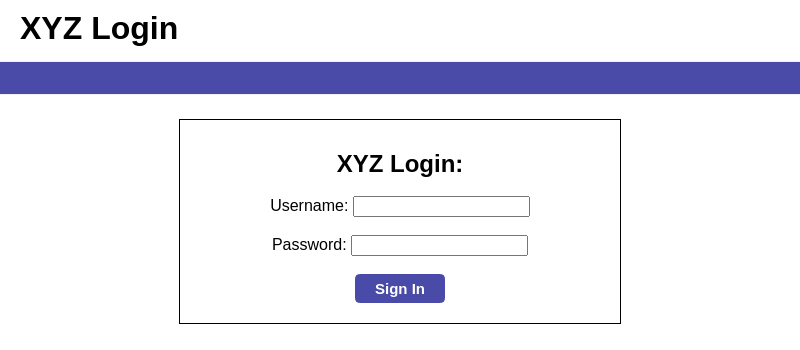
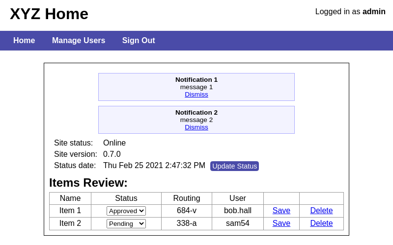

# Page Model Examples
This page describes the .pagemodel files for the sample html in the XYZ application generated in the [Getting Started Guide](../README.md#getting-started)

Before writing .pagemodel files, it is recommended to install the [pagemodel syntax highlighter](page-model-gen-readme.md#syntax-highlighter). 
## Login Page
We'll start with a simple login page


```html
<html>
  <head>
    <title>XYZ Login</title>
    <link href="style.css" rel="stylesheet" type="text/css">
  </head>
  <body>
    <div class="clearfix">
      <div id="header">
        <h1>XYZ Login</h1>
      </div>
      <div id="userInfo"></div>
    </div>
    <div id="topNav">
      <span class="nav-link"></span>
    </div>
    <div id="errorMsgs"></div>
    <div id="content-narrow">
      <h2>XYZ Login:</h2><br/>
      <div>
        Username: <input type="text" id="username">
      </div><br/>
      <div>
        Password: <input type="text" id="password">
      </div><br/>
      <div>
        <input type="button" id="signInButton" class="control-button" value="Sign In" onclick="signIn()">
      </div>
    </div>
  </body>
</html>
```

##### Login Page Elements
There are 5 elements on the page needed for testing.  3 immediate functional elements: The `username field`, `password field`, and `sign in button`.  There is a `header display`.  And, there is a hidden `error messages display`. 

### LoginPage.pagemodel
```
PageModel com.example.xyz.pages

* HeaderDisplay xpath "//h1[1]"
ErrorDisplay id "errorMsgs"
* UsernameField id "username"
* PasswordField id "password"
* SignInButton id "signInButton" HomePage
```

The file is named `LoginPage.pagemodel` and wil generate `LoginPage.java`

In first line, 
```
PageModel com.example.xyz.pages
```
`PageModel` declares LoginPage as regular PageModel.
 
 The next value `com.example.xyz.pages` declares the package for PageModel.java
 
 The remaining lines declare the elements on the page.
 ```
* HeaderDisplay xpath "//h1[1]"
```
`*` - marks the element as always displayed on the page, used to determine if the page is displayed.

`HeaderDisplay` - `Header` name of the element, `Display` element type.

`xpath "//h1[1]"` - Use selenium `By.xpath("//h1[1]")` to locate the element.

```
ErrorDisplay id "errorMsgs"
```
The ErrorDisplay element is only present after an error occurs.  This element is not always disaplyed, so not preceded with a `*`

```
* SignInButton id "signInButton" HomePage
```
`*` - The sign in button is always displayed

`SignInButton` - `SignIn` visual label of the button used as the name, `Button` button type element.

`id "signInButton"` - located using `By.id("signInButton")`

`HomePage` - Clicking the sign in button is expected to navigate to the page defined in `HomePage.pagemodel`

### Login Page Testing
A test to login, logout, attempt to login with a bad password, verify the error message and close the browser: 
```java
context.getLoginPage()
        .testUsernameField().sendKeys("admin")
        .testPasswordField().sendKeys("password")
        .testSignInButton().click()
        .testTopNav().testSignOutButton().click()
        .testUsernameField().sendKeys("admin")
        .testPasswordField().sendKeys("bad password")
        .testSignInButton().clickAnd().noRedirect()
        .testErrorMessagesDisplay().text().contains("bad username or password")
        .closeBrowser();
```

```java
context.getLoginPage()
```

Open the browser for the `XYZTestContext` and go to the login page url.  Returns a `LoginPage` object.

A typical test would start with `XYZUser.admin(context).loginToMainPage()` to go straight to the `HomePage` instead of using `context.getLoginPage()`. 

```java
.testUsernameField().sendKeys("admin")
```

get a `WebElementTester` for the username field and type "admin" into the username field.  Returns a `LoginPage` object.

A typical test would not have "admin" or "password" hardcoded.  They would instead define at the top `XYZUser admin = XYZUser.admin(context);` and then use `admin.getUsername()` and `admin.getPassword()`.

 ```java
 .testSignInButton().click()
```

perform the click action for the sign in button `WebElementTester`.  Returns a `HomePage` object.
 
 ```java
 .testTopNav().testSignOutButton().click()
```
 
 Gets the `TopNav` `ComponentModel` from the `HomePage`.  (A component model is a special `WebElementTester` with child elements.)  Then get the sign out button from the `TopNav` component and click.  Returns a `LoginPage` object.
 
 ```java
 .testSignInButton().clickAnd().noRedirect()
```
 
 Use `clickAnd()` to override the normal `ClickAction` behavior of expecting to navigate to the `HomePage`, `clickAnd()` will provide methods for expecting no redirect, a redirect to a type of page, or handling alerts.
 `.noRedirect()` tells the test we expect to stay on the `LoginPage` after clicking the `SignInButton`
 
 ```java
 .testErrorMessagesDisplay().text().contains("bad username or password")
```
 
 After the failed sign in attempt, the `ErrorMessagesDisplay` element is tested to have text containing "bad username or password".
 
 Calling `.text()` on a `WebElementTester` will return a `StringTester` with a lambda reference to the `String` `WebElement.getText()`.  The `StringTester` provides methods for testing anything exposed by the `String` class such as `contains`, `equals`, `startsWith`, `matches`, `length`, etc.
 
 Along with the `StringTester` is a `ComparableTester` for testing anything implementing `Comparable` such as `Integer`, `Double`, or `Date`.  `.testErrorMessagesDisplay().text().length()` will return a `ComparableTester` with a lambda reference to the `int` `WebElement.getText().length()`
 
 ```java
 .closeBrowser();
```
 
 Close the browser associated with the `TestContext`, ending the test chain.
 
 ## Internal Pages
 Once logged in we are on the Home Page:
 
 
 
 When logged into a typical application, all pages have common elements, usually navigation, headers, and footers.
 
 The common header html is:
 ```html
<body>
    <div class="clearfix">
      <div id="header">
        <h1>XYZ Home</h1>
      </div>
      <div id="userInfo">Logged in as <b>admin</b></div>
    </div>
    <div id="topNav">
      <span class="nav-link"><a id="navHome" href="home.html">Home</a></span>
      <span class="nav-link"><a id="navManageUsers" href="manage_users.html">Manage Users</a></span>
      <span class="nav-link"><a id="navSignOut" href="login.html">Sign Out</a></span>
    </div>
    ...
</body>
```
### XYZInternalPage.pagemodel
```
AbstractPageModel com.example.xyz.pages

* TopNav @@XYZTopNav id "topNav"

@ComponentModel XYZTopNav
  * UserInfoDisplay ^id "userInfo"
  * HomeLink id "navHome" HomePage
  ManageUsersLink id "navManageUsers" ManageUsersPage
  * SignOutLink id "navSignOut" LoginPage
@EndComponent
```
This pagemodel declares an abstract page model to be inherited by other pages.  It has a single element `TopNav` with the type of `XYZTopNav` instead of the normal `WebElementTester`.  The type `XYZTopNav` is declared as an inner `ComponentModel` containing `UserInfoDisplay`, `HomeLink`, `ManageUsersLink`, and `SignOutLink`.

`AbstractPageModel` - declares `XYZInternalPage` as abstract, to be inherited by other page.

```
* TopNav @@XYZTopNav id "topNav"
```
`*` - the `TopNav` is always displayed

`TopNav` - named TopNav to reflect `Nav` type component located at the `Top`

`@@XYZTopNav` - return a `XYZTopNav` component instead of a simple `WebElementTester`.

The `@@` denotes this type has 1 type parameter, `@` denotes no type parameters, and `@@@` denotes 2 type parameters.  The number of type parameters vary for `ComponentModels(2)`, `inner-ComponentModels(1)`, `SectionModels(1)`, `inner-SectionModels(0)`.

```
@ComponentModel XYZTopNav
```
This line starts an `inner-ComponentModel`, it will generate a java inner-class named `XYZTopNav` of type `ComponentModel` in the `HomePage` java class.

```
ManageUsersLink id "navManageUsers" ManageUsersPage
```
This declares `ManageUsersLink` as a child element of the `XYZTopNav` element.

`id "navManageUsers"` - will search for an element with id `navManageUsers` contained within the `MyTopNav` (`id "topNav"`).  In selenium this would be `driver.findElement(By.id("topNav")).findElement(By.id("navManageUsers"))`

`ManageUsersPage` - clicking `ManageUsersLink` is expected to navigate to `ManageUsersPage`

```
* UserInfoDisplay ^id "userInfo"
```
This declares `UserInfoDisplay` as an element of the `XYZTopNav` component, but not contained within the `XYZTopNav` root element.

`^id "userInfo"` - The `^` before `id` will search the entire page for the element instead of searching only within the component root element.  In selenium this would be `driver.findElement(By.id("userInfo"))`

### HomePage.pagemodel
XYZ Home Page comes from [home.html](../org.pagemodel.tests/example_html/home.html)
```
XYZInternalPage com.example.xyz.pages

* HeaderDisplay xpath "//h1[1]" *.text().equals("XYZ Home")
* SiteStatusDisplay id "siteStatus"
* SiteVersionDisplay id "siteVersion"
* StatusDateDisplay id "statusDate"
* UpdateStatusButton id "updateStatus"

NotificationDisplay @@NotificationDialog xpath "//div[@id='notifications']/div[i%notificationNum%]"
NotificationDisplay @@NotificationDialog xpath "//div[@id='notifications']/div/div[1][text()='s%title%']//parent::div"

ItemReviewRow @@ItemReviewRow xpath "//table[@id='itemReviewTable']/tbody/tr/td[1][text()='s%itemName%']//parent::tr"

@ComponentModel NotificationDialog
  TitleDisplay cssSelector "div:nth-child(1)"
  MessageDisplay cssSelector "div:nth-child(2)"
  DismissLink cssSelector "a.notif-dismiss"
@EndComponent

@ComponentModel ItemReviewRow
  NameDisplay cssSelector "td:nth-child(1)"
  StatusDropDown cssSelector "td:nth-child(2) > select"
  RoutingDisplay cssSelector "td:nth-child(3)"
  UserDisplay cssSelector "td:nth-child(4)"
  SaveLink cssSelector "td:nth-child(5) > a"
  DeleteLink cssSelector "td:nth-child(6) > a"
@EndComponent
```
The top line  
```
XYZInternalPage com.example.xyz.pages
```
 declares `HomePage` as inheriting from `XYZInternalPage`, giving it the `TopNav` element defined there.
 
 ```
* HeaderDisplay xpath "//h1[1]" *.text().equals("XYZ Home")
```
In this line `*.text().equals("XYZ Home")` overrides the default behavior for an element marked with `*`.  By default, `HomePage.testModelDisplayed` would call `.testHeaderDisplay().isDisplayed()`.  This line would have it instead call `.testHeaderDisplay().text().equals("XYZ Home")`.  The `HomePage` would nto be considered to be displayed unless there is a `.HeaderDisplay` element with text equal to "XYZ Home".

```
NotificationDisplay @@NotificationDialog xpath "//div[@id='notifications']/div[i%notificationNum%]"
```
`i%notificationNum%` - The xpath string contains `i%notificationNum%`, declaring an `integer` variable named `notificationNumber` needed for locating a dynamic element.  This would define `testNotificationDisplay(int notificationNumber)` using selenium `driver.findElement(By.xpath("//div[@id='notifications']/div[" + notificationNumber + "]"))`.

## Further Reading
Read more about the full [.pagemodel file format syntax](page-model-gen-readme.md#file-format).

See the [selenium usage map](selenium-usage-map.md) for details on the selenium functionality exposed by Page Model Tools classes.